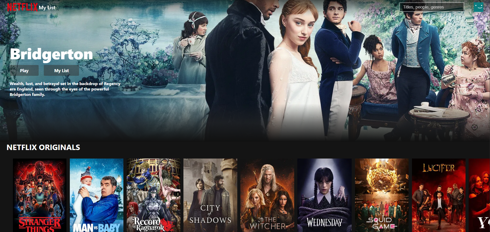
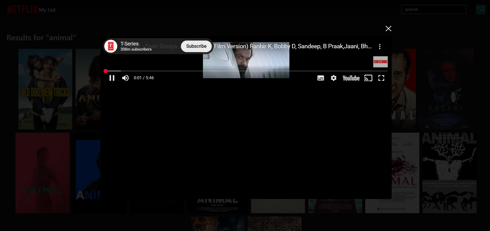
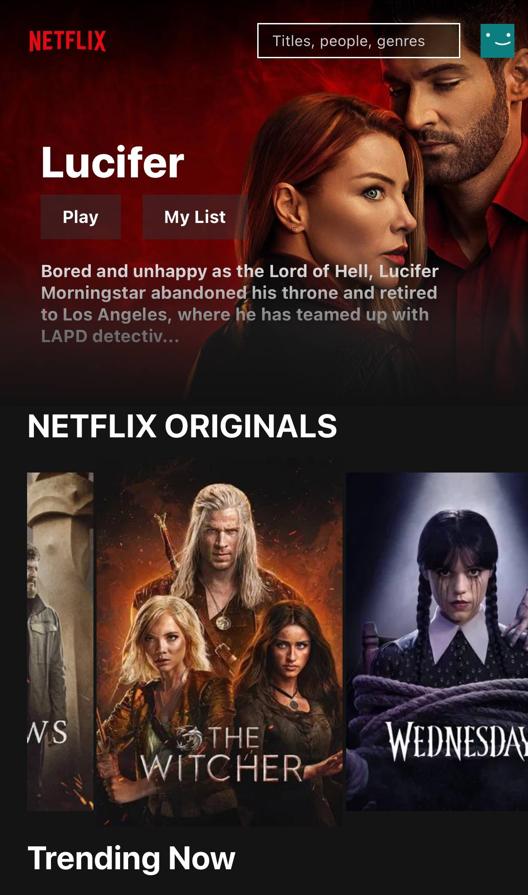

# 🎬 Netflix Clone

A modern, responsive **Netflix-inspired web application** built using **React 19** and **Vite**, powered by the **TMDB API**.  
This project focuses on clean UI, real-world UX patterns, and scalable frontend architecture.

> ⚠️ This project is for **educational and portfolio purposes only**.  
> It is **not affiliated with or endorsed by Netflix**.

---

## [🚀 Live Demo](https://netflli.netlify.app/)

---

## 📸 Screenshots

### Home Page

### Search Page

### Trailer Modal

### Mobile View

---

## ✨ Features

- 🎥 Browse movies by categories (Trending, Top Rated, Action, Comedy, etc.)
- ⭐ Netflix Originals section
- 🔍 Dedicated **Search page** with debounced input
- 🎬 **Trailer modal**
  - Full-screen overlay
  - Click outside to close
  - ESC key support
- 📱 Fully **responsive design** (mobile, tablet, desktop)
- ⚡ Fast performance using **Vite**
- 🎨 Netflix-style UI using **vanilla CSS**
- ❤️ Watermark credit: *Made with love by Team Alpha*

---

## 🛠️ Tech Stack

### Core
- React 19
- Vite

### Routing
- React Router DOM

### Data & API
- Axios
- TMDB API

### Styling
- Vanilla CSS 3  
- Component-level CSS for precise animations and layout control

### Media & UX
- react-youtube
- movie-trailer
- react-icons

---

## 📡 TMDB Attribution

This product uses the **TMDB API** but is **not endorsed or certified by TMDB**.

---

## 🧠 Key Implementation Highlights

- Centralized API handling using a custom Axios instance
- Reusable and composable React components
- Debounced search to reduce unnecessary API calls
- Trailer playback via a reusable modal component
- Mobile-first responsive design
- Clean separation of concerns between UI, pages, and services

---

## 📈 Future Enhancements

- Skeleton loaders for improved loading UX
- Watchlist feature using localStorage or Firebase
- Authentication (Firebase / Auth0)
- Keyboard navigation and accessibility improvements
- Performance optimization & Lighthouse audit
- AI-based movie recommendations

---

## 🧑‍💻 Author

**N A N I**  
Built with ❤️ for learning, experimentation, and portfolio demonstration.

---

## 📄 License

This project is licensed under the **MIT License**.

